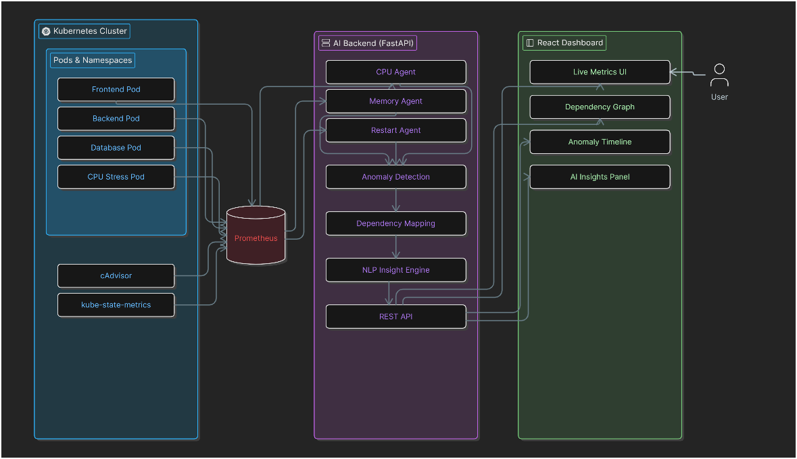

# AI Observability System for Kubernetes

## Overview

AI Observability System is an AI-powered Kubernetes monitoring and anomaly detection platform built for real-time pod resource discovery, dependency analysis, and intelligent infrastructure observability.

The system collects live telemetry from a Kubernetes cluster using Prometheus and analyzes pod-level CPU and memory metrics using AI-based anomaly detection.

This project was built using:

* Kubernetes (Minikube)
* Prometheus
* Grafana
* Python FastAPI
* Scikit-learn
* Docker
* WSL2 Ubuntu

---

# Features

## Current Features

* Kubernetes cluster monitoring
* Real-time CPU telemetry collection
* AI-based anomaly detection
* FastAPI REST backend
* Prometheus integration
* NLP-style observability insights
* Swagger API documentation
* Grafana dashboard support

---

# System Architecture



---

# Prerequisites

Before starting, install the following:

## Windows Requirements

* Windows 10/11
* WSL2 enabled
* Ubuntu 22.04 installed
* Docker Desktop
* VS Code

---

# Step 1 — Install WSL2

Open PowerShell as Administrator:

```powershell
wsl --install
```

Restart the PC.

Install Ubuntu 22.04 from Microsoft Store.

Verify installation:

```powershell
wsl -l -v
```

Expected:

```text
Ubuntu    Running    2
```

---

# Step 2 — Install Docker Desktop

Install Docker Desktop:

[https://www.docker.com/products/docker-desktop/](https://www.docker.com/products/docker-desktop/)

Enable:

* Use WSL2 based engine
* Enable Ubuntu integration

Verify Docker:

```bash
docker version
```

Test Docker:

```bash
docker run hello-world
```

---

# Step 3 — Install kubectl

Inside Ubuntu terminal:

```bash
curl -LO "https://dl.k8s.io/release/$(curl -L -s https://dl.k8s.io/release/stable.txt)/bin/linux/amd64/kubectl"
chmod +x kubectl
sudo mv kubectl /usr/local/bin/
```

Verify:

```bash
kubectl version --client
```

---

# Step 4 — Install Minikube

```bash
curl -LO https://storage.googleapis.com/minikube/releases/latest/minikube-linux-amd64
sudo install minikube-linux-amd64 /usr/local/bin/minikube
```

Verify:

```bash
minikube version
```

---

# Step 5 — Start Kubernetes Cluster

```bash
minikube start --driver=docker
```

Verify:

```bash
kubectl get nodes
```

Expected:

```text
minikube   Ready
```

---

# Step 6 — Install Helm

```bash
curl https://raw.githubusercontent.com/helm/helm/main/scripts/get-helm-3 | bash
```

Verify:

```bash
helm version
```

---

# Step 7 — Install Monitoring Stack

## Add Prometheus Repository

```bash
helm repo add prometheus-community https://prometheus-community.github.io/helm-charts
helm repo update
```

## Create Monitoring Namespace

```bash
kubectl create namespace monitoring
```

## Install Prometheus + Grafana Stack

```bash
helm install monitoring prometheus-community/kube-prometheus-stack -n monitoring
```

Wait until all pods are running:

```bash
kubectl get pods -n monitoring
```

---

# Step 8 — Open Prometheus

```bash
kubectl port-forward svc/monitoring-kube-prometheus-prometheus 9090:9090 -n monitoring
```

Open browser:

```text
http://localhost:9090
```

---

# Step 9 — Open Grafana

Open a new terminal:

```bash
kubectl port-forward svc/monitoring-grafana 3000:80 -n monitoring
```

Open browser:

```text
http://localhost:3000
```

Get Grafana password:

```bash
kubectl get secret monitoring-grafana -n monitoring -o jsonpath="{.data.admin-password}" | base64 --decode
```

Username:

```text
admin
```

---

# Step 10 — Create Project

```bash
mkdir ai-observability
cd ai-observability
```

---

# Step 11 — Create Python Virtual Environment

```bash
python3 -m venv venv
source venv/bin/activate
```

---

# Step 12 — Install Python Dependencies

```bash
pip install fastapi uvicorn requests pandas scikit-learn networkx matplotlib
```

---

# Step 13 — Create Project Structure

```bash
mkdir -p agents services graphs

touch main.py

touch agents/cpu_agent.py

touch services/prometheus_client.py

touch services/anomaly_detector.py

touch services/nlp_insights.py

touch graphs/dependency_graph.py
```

---

# Final Project Structure

```text
ai-observability/
│
├── agents/
│   └── cpu_agent.py
│
├── services/
│   ├── prometheus_client.py
│   ├── anomaly_detector.py
│   └── nlp_insights.py
│
├── graphs/
│   └── dependency_graph.py
│
├── main.py
│
└── venv/
```

---

# Step 14 — Add Code Files

## services/prometheus_client.py

```python
import requests

PROMETHEUS_URL = "http://localhost:9090"


def query_prometheus(query):

    response = requests.get(
        f"{PROMETHEUS_URL}/api/v1/query",
        params={"query": query}
    )

    return response.json()
```

---

## services/anomaly_detector.py

```python
from sklearn.ensemble import IsolationForest


def detect_anomalies(df):

    model = IsolationForest(contamination=0.1)

    df["anomaly"] = model.fit_predict(df[["value"]])

    return df
```

---

## services/nlp_insights.py

```python
def generate_cpu_insight(pod, value, anomaly):

    if anomaly == -1:

        return f"Pod {pod} is showing abnormal CPU usage with value {value:.4f}"

    return f"Pod {pod} is operating normally"
```

---

## agents/cpu_agent.py

```python
import pandas as pd

from services.prometheus_client import query_prometheus
from services.anomaly_detector import detect_anomalies
from services.nlp_insights import generate_cpu_insight


def analyze_cpu():

    query = 'rate(container_cpu_usage_seconds_total[1m])'

    result = query_prometheus(query)

    data = result["data"]["result"]

    rows = []

    for item in data:

        pod = item["metric"].get("pod", "unknown")

        value = float(item["value"][1])

        rows.append({
            "pod": pod,
            "value": value
        })

    df = pd.DataFrame(rows)

    if df.empty:
        return []

    df = detect_anomalies(df)

    results = []

    for _, row in df.iterrows():

        insight = generate_cpu_insight(
            row["pod"],
            row["value"],
            row["anomaly"]
        )

        results.append({
            "pod": row["pod"],
            "value": row["value"],
            "anomaly": int(row["anomaly"]),
            "insight": insight
        })

    return results
```

---

## main.py

```python
from fastapi import FastAPI

from agents.cpu_agent import analyze_cpu

app = FastAPI()


@app.get("/")
def home():

    return {
        "message": "AI Observability System Running"
    }


@app.get("/cpu-analysis")
def cpu_analysis():

    return analyze_cpu()
```

---

# Step 15 — Start Prometheus Port Forward

Open terminal 1:

```bash
kubectl port-forward svc/monitoring-kube-prometheus-prometheus 9090:9090 -n monitoring
```

Keep this terminal running.

---

# Step 16 — Run FastAPI Backend

Open terminal 2:

```bash
cd ~/ai-observability
source venv/bin/activate
uvicorn main:app --reload
```

Open browser:

```text
http://127.0.0.1:8000/docs
```

---

# Step 17 — Generate CPU Stress

Create stress pod:

```bash
kubectl run cpu-stress --image=polinux/stress -- stress --cpu 2
```

Check pods:

```bash
kubectl get pods
```

---

# Step 18 — Test AI Detection

Open:

```text
http://127.0.0.1:8000/docs
```

Run endpoint:

```text
/cpu-analysis
```

Expected output:

```json
[
  {
    "pod": "cpu-stress",
    "value": 2.03,
    "anomaly": -1,
    "insight": "Pod cpu-stress is showing abnormal CPU usage with value 2.0380"
  }
]
```

---

# Current Capabilities

The system currently supports:

* Kubernetes monitoring
* Real-time telemetry collection
* CPU anomaly detection
* AI-based observability
* NLP-style infrastructure insights
* REST API integration

---

# Future Improvements

Planned features:

* Memory anomaly detection
* PVC/storage analysis
* Network dependency mapping
* Multi-agent AI framework
* Root cause analysis
* Forecasting engine
* Frontend dashboard
* Temporal dependency graphs
* LLM-based observability assistant

---

# Technologies Used

* Python
* FastAPI
* Kubernetes
* Docker
* Minikube
* Prometheus
* Grafana
* Scikit-learn
* NetworkX
* WSL2 Ubuntu

---

# API Endpoints

## Root Endpoint

```text
GET /
```

## CPU Analysis Endpoint

```text
GET /cpu-analysis
```
